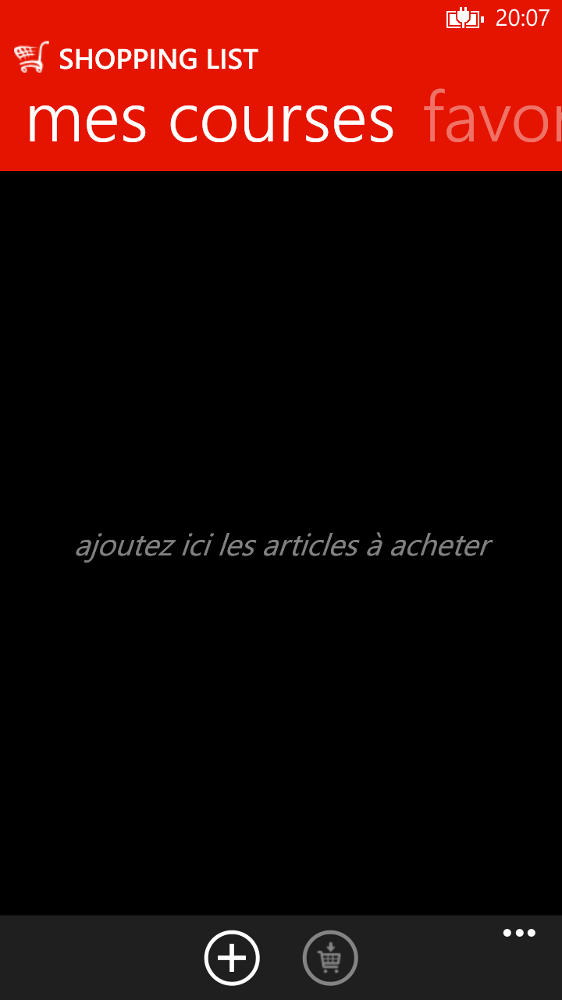
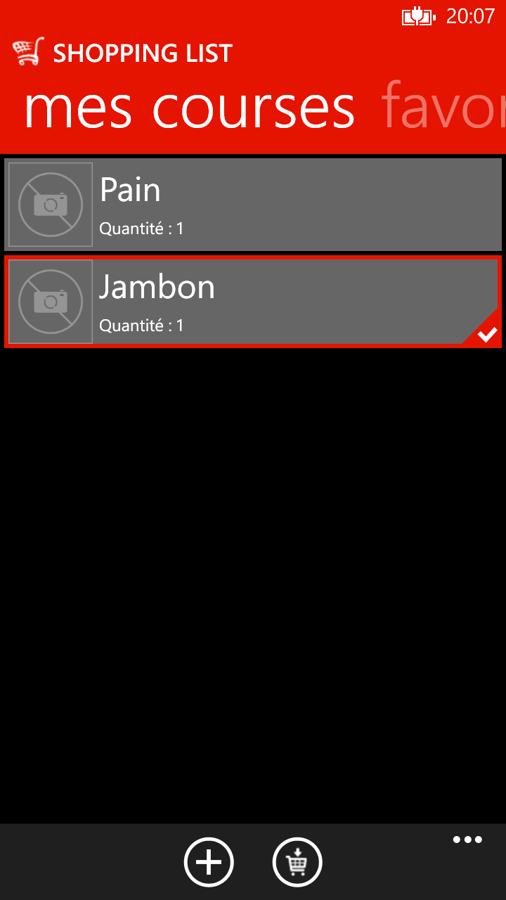
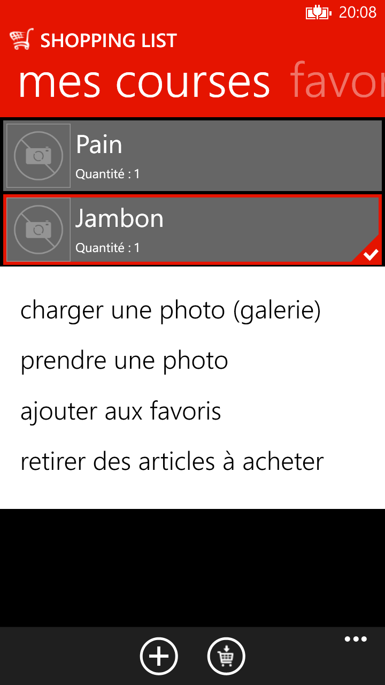

# Application ShoppingList pour Windows Phone et Windows Mobile 10

A la suite de la fermeture du Store pour Windows 10 - je publie mes applis au cas où cela serait utile à quelqu'un.

L'application sur le store : [ShoppingList](https://www.microsoft.com/store/apps/9NBLGGH0JWVV).

### Raison du projet

Ce projet est une première tentative d'une app Windows Phone avec une base de données et le multilingue.

### Description sur le store

```console
Gérez votre liste de courses le plus simplement possible en saisissant le nombre d'articles et leurs photos (appareil photo ou galerie).

Les favoris vous permettront de ne pas ressaisir vos articles préférés.
```

### Ouverture du projet

```console
Utilisez Microsoft Visual Studio 2012 avec le SDK Windows Phone 8.1
```

### Quelques captures

<p align="center">
 </br>
 
 &nbsp;
 
 &nbsp;
 
</p>
